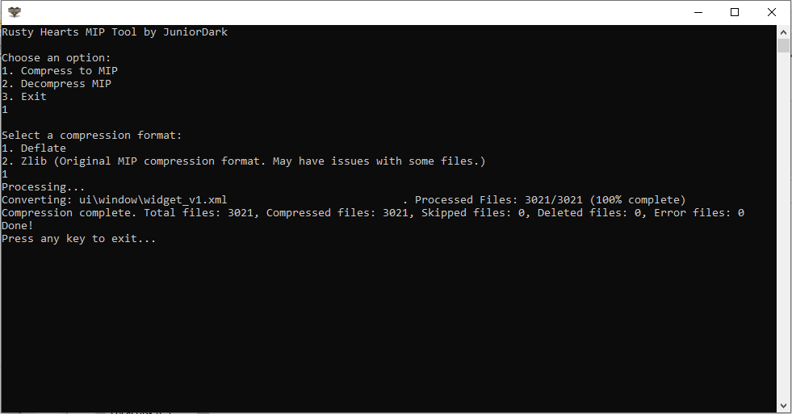
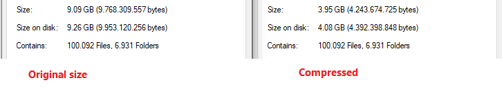

# Rusty Hearts MIP Tool

 <a href="https://github.com/JuniorDark/RustyHearts-MIPTool/releases">

A c# command-line tool for compressing and decompressing Rusty Hearts Patch files (.MIP).

## Getting Started
To get started with this tool, simply download the latest [release](https://github.com/JuniorDark/RustyHearts-MIPTool/releases/latest) from the GitHub repository. 

## Compression Formats
The Rusty Hearts MIP Tool supports two compression formats:
- **Deflate**: Main format. Used by the [Rusty Hearts Launcher](https://github.com/JuniorDark/RustyHearts-Launcher)
- **Zlib**: Legacy support. The original Rusty Hearts MIP compression format. May have issues with some files. Work with the official MPatcher. Dont work with [Rusty Hearts Launcher](https://github.com/JuniorDark/RustyHearts-Launcher)    
   
## Usage
1. Ensure that the input files to be compressed/decompressed are located in the "Input" folder within the program directory.
2. Run the program.
3. Choose one of the following options:
   - **1. Compress to MIP**: Program will compress the input files to MIP format.
   - **2. Decompress MIP**: Program will decompress the input files from MIP format.
   - **3. Exit**: Quit the program.
4. The resulting compressed/decompressed files will be located in the "Output" folder within the program directory.

### Client patch
You can place the MIP files in the `patch` directory of the [Rusty Hearts API](https://github.com/JuniorDark/RustyHearts-API) to patch the client using the [Rusty Hearts Launcher](https://github.com/JuniorDark/RustyHearts-Launcher).

## Prerequisites for Building Locally/Development
The tool is built in .NET 7 and as such, the packages listed below are required to create a local and development build of the tool. Furthermore, it uses many submodules and packages outside of this, which will automatically be loaded when the user sets up a local environment of the application.
* Visual Studio 2022 (Any Edition - 17.4 or later)
* Windows 10 SDK (10.0.19043.0) or Windows 11 SDK (10.0.22000.0) via Visual Studio Installer
* .NET: [.NET Core 7 SDK (7.0.100 or later)](https://dotnet.microsoft.com/en-us/download/dotnet/7.0)

## System Requirements for Ready-to-use build
* OS: Windows 10 1809 Update (build 17763) or later / Windows 11 (Any builds)
* Architecture: x64/AMD64

## Preview

   

## License
This project is licensed under the terms found in [`LICENSE-0BSD`](LICENSE).

## Contributing
Contributions from the community are welcome! If you encounter a bug or have a feature request, please submit an issue on GitHub. If you would like to contribute code, please fork the repository and submit a pull request.

## FAQ
* Q: How do I report a bug?
  * A: Please submit an issue on GitHub with a detailed description of the bug and steps to reproduce it.
* Q: How do I request a new feature?
  * A: Please submit an issue on GitHub with a detailed description of the feature and why it would be useful.
* Q: How do I contribute code?
  * A: Please fork the repository, make your changes, and submit a pull request.

## Credits
The following third-party libraries, tools, and resources are used in this project:
* [Crc32.NET](https://www.nuget.org/packages/Crc32.NET)
* [DotNetZip](https://www.nuget.org/packages/DotNetZip)

## Support
If you need help with the tool, please submit an issue on GitHub.
