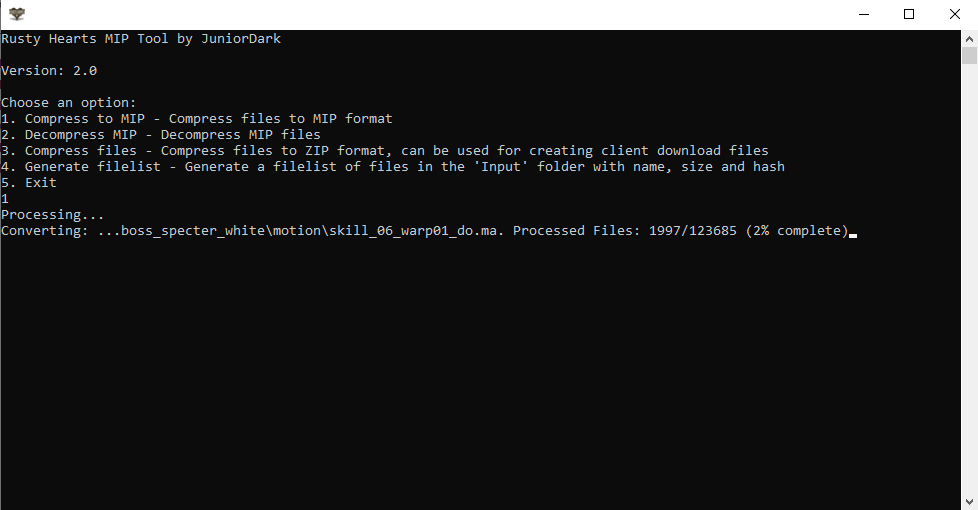

# Rusty Hearts MIP Tool

 <a href="https://github.com/JuniorDark/RustyHearts-MIPTool/releases">

A c# command-line tool for creating Rusty Hearts Client Patch files (.MIP).

## Preview

   

## Getting Started
To get started with this tool, simply download the latest [release](https://github.com/JuniorDark/RustyHearts-MIPTool/releases/latest) from the GitHub repository. 

## Usage
1. Ensure that the input files to be compressed/decompressed are located in the "Input" folder within the program directory.
2. Run the program.
3. Choose one of the following options:
   - **1. Compress to MIP**: Compress files to MIP format.
   - **2. Decompress MIP**:  Decompress MIP files.
   - **3. Compress files**: Compress files to ZIP format, can be used for creating client download files.
   - **4. Generate filelist** - Generate a filelist of files in the 'Input' folder with name, size and hash
   - **5. Exit**: Quit the program.
4. The resulting files will be located in the "Output" folder within the program directory.

### Client patch
Place the MIP files and filelist in the `patch` directory of the [Rusty Hearts API](https://github.com/JuniorDark/RustyHearts-API) to patch the client using the [Rusty Hearts Launcher](https://github.com/JuniorDark/RustyHearts-Launcher).

### Client ZIP files
Place the ZIP files and filelist in the `download/client` directory of the [Rusty Hearts API](https://github.com/JuniorDark/RustyHearts-API) to download the client using the [Rusty Hearts Launcher](https://github.com/JuniorDark/RustyHearts-Launcher).

## Prerequisites for Development
* Visual Studio 2022 (Any Edition - 17.12 or later)
* Windows 10 SDK or Windows 11 SDK via Visual Studio Installer
* .NET Core 9 SDK (9.0.100 or later)

## Building

If you wish to build the project yourself, follow these steps:

### Step 1

Install the [.NET 9.0 (or higher) SDK](https://dotnet.microsoft.com/download/dotnet/9.0).
Make sure your SDK version is higher or equal to the required version specified. 

### Step 2

Either use `git clone https://github.com/JuniorDark/RustyHearts-MIPTool` on the command line to clone the repository or use Code --> Download zip button to get the files.

### Step 3

To build the project, open a command prompt inside the project directory.
You can quickly access it on Windows by holding shift in File Explorer, then right clicking and selecting `Open command window here`.
Then type the following command: `dotnet build -c Release`.
 
The built files will be found in the newly created `bin` build directory.

## License
This project is licensed under the terms found in [`LICENSE-0BSD`](LICENSE).

## Credits
The following third-party libraries are used in this project:
* [Crc32.NET](https://www.nuget.org/packages/Crc32.NET)
